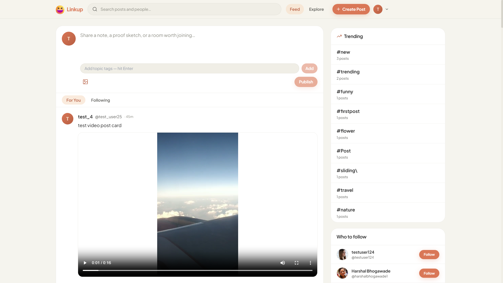
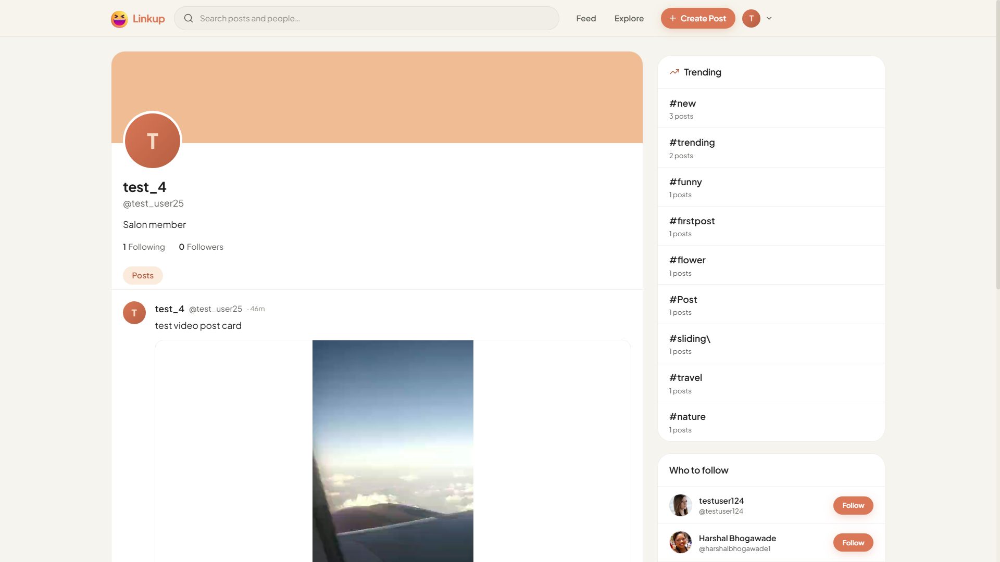
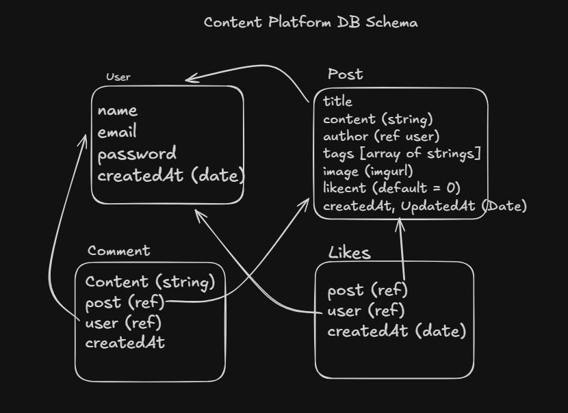

# LinkUp

A full-stack social media platform for sharing posts, discovering users, and building conversations.

Live Link : [LinkUp](https://social-media-app-nu-two-29.vercel.app/)

[](https://www.codefactor.io/repository/github/harshall25/social-media-app)

## Features

- User signup and login with JWT authentication
- Create, edit, and delete posts
- Image and video uploads using Cloudflare R2
- Like and comment on posts
- Follow and unfollow users
- Public and following feeds
- User and post search
- Trending hashtags
- User profiles and suggested users
- Responsive light/dark UI
- API rate limiting

## Screenshots

<div align="center">
  
</div>

<div align="center">
  
  
</div>

## Tech Stack

- **Frontend:** React, Vite, Tailwind CSS
- **Backend:** Node.js, Express
- **Database:** MongoDB + Mongoose
- **Authentication:** JWT + bcrypt
- **Media Storage:** Cloudflare R2
- **Deployment:** Vercel
- **CI/CD:** GitHub Actions

## Architecture

```text
React + Vite
     │
     │ REST API
     ▼
Node.js + Express
     │
     ├── MongoDB
     │
     └── Cloudflare R2
```

The backend follows a lightweight MVC/layered structure with routes, controllers, middleware, models, and configuration adapters.

## Data Model
<div align="center">
  
</div>

## API

All APIs use:

```text
/api/v1
```

Main endpoints:

```text
POST   /auth/signup
POST   /auth/signin

GET    /posts
POST   /posts/create
PATCH  /posts/:id
DELETE /posts/:id
POST   /posts/:id/like
GET    /posts/:id/comments
POST   /posts/:id/comments

POST   /users/:userId/follow
DELETE /users/:userId/follow
GET    /users/:userId/followers
GET    /users/:userId/following
GET    /users/search
GET    /users/suggested
GET    /users/me

POST   /media/upload
DELETE /media/delete/:fileName
GET    /media/file/:fileName
```

## Local Development

### Requirements

- Node.js 20+
- MongoDB
- Cloudflare R2 credentials

### Install

```bash
npm run install:all
```

Create `server/.env`:

```env
PORT=8080
MONGODB_URI=mongodb://localhost:27017/social-media
JWT_SECRET=your-secret

R2_ACCOUNT_ID=your-account-id
R2_ACCESS_KEY_ID=your-access-key
R2_SECRET_ACCESS_KEY=your-secret-key
R2_BUCKET_NAME=your-bucket

BASE_URL=http://localhost:8080
```

Run:

```bash
npm run dev:server
npm run dev:client
```

Frontend:

```text
http://localhost:5173
```

Backend:

```text
http://localhost:8080/api/v1
```

## Build & Deployment

```bash
npm run build
```

GitHub Actions handles CI checks, while Vercel handles frontend and backend deployment.

```text
GitHub
   │
   ▼
Vercel
   ├── React frontend
   └── Express API
         │
         ├── MongoDB
         └── Cloudflare R2
```

See:

- `docs/DEPLOYMENT.md`
- `docs/CI-CD.md`

## Limitations / Future Improvements

- Add automated API and component tests
- Add database indexes for common queries
- Replace offset pagination with cursor pagination
- Use shared rate limiting such as Redis
- Improve large-file media uploads and streaming
- Add structured logging and monitoring

## License

No license specified.
